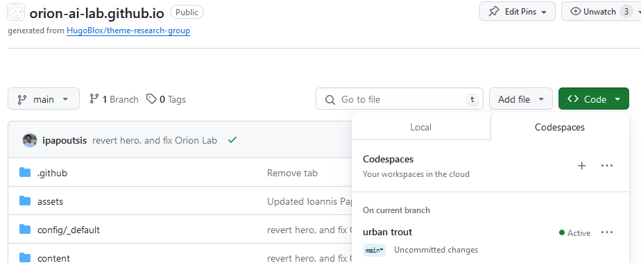

# Orionlab research page

The page is based on the [theme-research-block](https://github.com/HugoBlox/theme-research-group). Extended documentation [here](https://docs.hugoblox.com/).

## Initial Setup

1. Run a GitHub codespace [](https://codespaces.new/Orion-AI-Lab/orion-ai-lab.github.io).

2. Create a new conda environment with Python 3.11
```
conda create --name myenv python=3.11
```
3. Activate the environment
```
source activate myenv
```
4. Install [academic python library](https://pypi.org/project/academic/) that will be used to add bib files to webpages.
```
pip install academic
```

**Important Note** After the initial setup, run the codespace using the green `<> Code` button at the top of the repo page. 
 
 

## Running the server locally

1. Run a GitHub codespace (green `<> Code` button)
2. Run the server. Go to the terminal and hit the following:
```
./hugo server
```
Note!!! This must be run from the repo directory.

3. Open the browser from the ports tab. Sometimes you may need to restart the server (CTRL+C and re-run step 2) and hard refresh (CTRL+F5) to see your changes. 

## Adding a new publication

1. Activate the conda environment

```
source activate myenv
```

2. Add the .bib file (let's say my_bib.bib) for your publication to content/publication/bibdir

3. Import the .bib file

```
academic import content/publication/bibdir/my_bib.bib content/publication -v --compact
```

4. Edit the created index.md to add more info and additional links to pdf, code, etc.

5. Add an image called `featured.(jpg|png)` to the created directory.

6. Save your changes to the GitHub repo (see [git helper](/#git-helper)).

> **Important Note**: If the publication **includes code and/or dataset**, add `categories: ['Code']` or `categories: ['Datasets']` or `categories: ['Code', 'Datasets']` accordingly so that the publication shows up in the [Code](https://orion-ai-lab.github.io/category/code) and/or [Datasets](https://orion-ai-lab.github.io/category/datasets) page. 

## Git helper

Below you see the workflow you need to follow when you have added/edited files and you want to update the GitHub repo.

```
# See changes that you did (Optional)
git status

# Get the latest changes in case someone else has committed something in the meantime
git pull 

# Stage changes to be committed 
git add . 

# Verify the staged files (Optional)
git status

# Commit changes 
# Note: if you don't have write access, you cannot push changes. A new fork will be created and this codespeace will be pointed there. Create a pull request of your changes and wait for admin's approval
git commit -m "This is the commit message, e.g. Fix bug, Change profile, Add article"

# Push changes to the GitHub repo
git push
```
